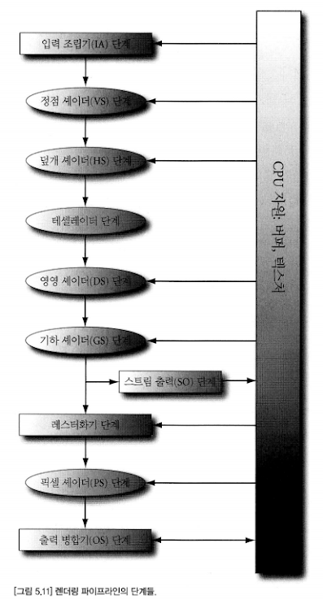

# Chapter5_IA_VS. 렌더링 파이프라인 (입력 조립기 ~ 정점 셰이더)

### 렌더링 파이프라인의 개요
--------------------------------------------------
* 렌더링 파이프라인은 3차원 장면의 기하학적 서술과 가상 카메라의 위치 및 방향이 주어졌을 때 현재 가상 카메라에 비친 3차원 장면의 모습에 근거해서 2차원 이미지를 생성하는 데 필요한 일련의 단계들 전체를 가리키는 용어다.

* 자원 메모리 풀에서 파이프라인의 단계로 가는 화살표는 단계가 자원을 입력으로 사용할 수 있음을 뜻하고, 단계에서 자원으로 가는 화살표는 그 단계가 GPU 자원에 자료를 기록할 수 있음을 뜻한다.
* 예를 들어 출력 병합기 단계는 후면 버퍼/깊이.스텐실 버퍼 같은 텍스처에 자료를 기록한다. 

### 입력 조립기(IA) 단계
--------------------------------------------------
* 입력 조립기(Input Assembler, IA) 단계는 메모리에서 기하 자료를 읽어 삼각형, 선분, 점 등과 같은 기하학적 기본 도형(primitive)을 조립한다.
#### 정점
* 삼각형의 정점은 두 변이 만나는 점, 선분의 정점은 선분의 양 끝점, 하나의 점의 정점은 그 점 자체이다.
* Direct3D의 정점은 공간적 위치 이외의 정보도 담을 수 있다. 따라서 복잡한 렌더링 효과의 구현이 가능하다. 예를 들어 조명을 구현하기 위해 정점에 법선 벡터를 추가하거나, 텍스처 적용을 위해 정점에 텍스처 좌표를 추가할 수 있다. Direct3D는 응용 프로그램이 자신만의 정점 형식을 정의할 수 있는 유연성을 제공한다.
#### 기본도형 위상구조
* 정점들은 정점 버퍼라고 하는 특별한 Direct3D 자료구조 안에 담겨서 렌더링 파이프라인에 묶인다.
* 정점 버퍼는 정점들을 연속적인 메모리에 저장하는 자료구조이다. 정점 버퍼 자체에는 기본도형을 형성하기 위해 정점들을 조합하는 방법(선분인지 삼각형인지)에 관한 정보가 없다.
* 정점을 이용해서 기하학적 기본도형을 형성하는 방법을 Direct3D에 알려주려면 **기본도형 위상구조** 라는 것을 설정해야 한다. 대부분 삼각형 목록을 사용한다.
  
  * **점 목록** : 점 목록이 설정된 상태에서 그리기 호출의 모든 정점은 개별적으로 그려진다.
  ####
  * **선 띠** : 선 띠가 설정된 상태에서 그리기 호출의 정점들은 차례로 연결된 선분들을 형성한다. n+1 개의 정점으로 n개의 선분이 그려진다.
  ####
  * **선 목록** : 선 목록이 설정된 상태에서 그리기 호출의 매 정점 두 개가 하나의 선분을 형성한다. 2n 개의 정점으로 n개의 선분이 그려진다.
  ####
  * **삼각형 띠** : 삼각형 띠가 설정된 상태에서 그리기 호출의 정점들은 연결되어서 삼각형을 형성한다. 인접한 두 삼각형이 정점들을 공유하며, 결과적으로 n개의 정점으로 n-2개의 삼각형이 만들어진다. 삼각형 띠에서는 짝수 번째 삼각형과 홀수 번째 삼각형들의 정점들이 *감기는 순서가 다르다.* 
  ####
  * **삼각형 목록** : 삼각형 목록이 설정된 상태에서 그리기 호출의 매 정점 세 개가 하나의 삼각형을 형성한다. 3n 개의 정점으로 n개의 삼각형이 만들어진다.
  ####
  * 인접성 정보를 가진 기본도형
  삼각형 목록을 만들 때 각 삼각형에 그에 접한 이웃 삼각형 세 개에 관한 정보를 포함할 수 있다. 그렇게 만든 삼각형 목록을 "인접성 정보를 가진 삼각형 목록"이라고 부르고, 주어진 삼각형에 접한 삼각형들을 인접 삼각형이라고 부른다. 
  이런 삼각형 목록은 인접 삼각형들에 접근해야 하는 특정한 기하 셰이딩 알고리즘을 기하 셰이더에서 구현할 때 사용된다. 기하 셰이더가 그런 인접 삼각형들에 접근하려면 삼각형 자체와 함께 인접 삼각형들의 정보도 정점 버퍼와 색인 버퍼에 담아 파이프라인에 제출해야 한다.
  인접 기본도형의 정점들은 오직 기하 셰이더의 입력으로만 사용되며 실제로 그려지진 않는다.
  ####
  * 제어점 패치 목록 : 정점 자료를 제어점들로 이루어진 패치 목록으로 해석해야 함을 뜻한다. 렌더링 파이프라인의 테셀레이션 단계에 사용된다.
#### 색인
  * 고형 3차원 물체의 기본 구축 요소는 삼각형이다. 이 때 삼각형의 정점들을 지정하는 순서가 중요한데, 이를 감기 순서라고 부른다.
  * 하나의 3차원 물체를 형성하는 삼각형들은 여러 개의 정점을 공유하며, 물체가 복잡할수록 중복되는 정점이 많아진다. 하지만 정점들의 중복은 바람직하지 않다.
    * 메모리 요구량이 증가한다. (같은 정점 자료를 여러 번 저장)
    * 그래픽 하드웨어 처리량이 증가한다. (같은 정점 자료를 여러 번 처리)
  * 삼각형 띠를 사용하면 중복 정점 문제가 완화되지만, 모든 모형의 기하구조를 삼각형 띠로 구성하는 것이 불가능하다는 단점이 있다.
  * **색인**을 사용하면 해결이 가능하다. 색인을 이용하는 정점 목록과 함께 색인 목록을 하나 만든다. 정점 목록은 고유한 정점들로 이루어지고, 색인 목록은 어떤 정점들을 어떤 순서로 사용해서 삼각형을 형성해야 하는지 나타내는 색인들로 이루어진다. 
  * 색인은 그냥 정수이므로 완전한 정점 구조체보다 적은 양의 메모리를 차지하고, 정점들이 적절한 순서로 캐시에 저장될 때 그래픽 하드웨어가 중복된 정점들을 처리할 필요가 없다는 장점이 있다.
  
### 정점 셰이더 단계
--------------------------------------------------
* 입력 조립기 단계에서 기본도형들을 조립한 후, 해당 정점들을 정점 셰이더 단계로 넘겨준다.
* 정점 셰이더(vertex shader) 는 정점 하나를 받아 정점 하나를 출력하는 함수로 생각할 수 있다. 화면에 그려질 모든 정점은 이 정점 셰이더를 거친다. 
```C++
for(UINT i=0; i < numVertices; ++i)
  outputVertex[i] = VertexShader(inputVertex[i]);
```
* 위와 같은 일을 하드웨어 안에서 동작시킨다고 할 수 있다.
* 정점 셰이더 함수의 구체적인 내용은 프로그래머가 구현해서 GPU에 제출한다.
* 변환, 조명, 변위 매핑 등 수많은 특수 효과를 정점 셰이더에서 수행할 수 있다. 정점 셰이더에서 입력 정점 자료에 접근하는 것은 물론 텍스처, 변환 행렬, 장면 광원 정보 등 GPU 메모리에 담긴 다른 자료에도 접근할 수 있다.
#### 국소 공간과 세계 공간
* 3D 아티스트들은 물체의 기하구조를 장면 전역의 좌표계(세계 공간)가 아니라 물체 자신의 국소 좌표계(국소 공간)를 기준으로 구축한다.
* 국소 공간에서 작업 시 물체의 중심 가까이에 원점을 둘 수 있고 좌표축들을 물체에 맞게 정렬할 수 있다.
* 국소 공간에서 3차원 모형의 정점들을 모두 정의했다면, 그것들을 세계 공간에 적절한 위치와 방향으로 배치해야 한다. 이를 위해서는 국소 공간과 세계 공간의 관계를 정의해야 한다. 전역 공간 좌표계에 상대적인 국소 공간 좌표계의 원점 위치와 축 방향들을 지정하고, 그에 해당하는 좌표 변경 변환을 수행해야 한다.
* 국소 좌표계에 상대적인 좌표를 전역 장면 좌표계에 상대적인 좌표로 바꾸는 것을 세계 변환이라고 부르고, 해당 행렬을 세계 행렬이라고 부른다.
* 장면의 모든 물체에는 각자의 세계 행렬이 있고, 각 물체를 자신의 국소 공간에서 세계 공간으로 변환하고 나면 모든 물체의 좌표가 동일한 세계 공간에 상대적인 좌표가 된다.
* 국소 좌표계의 장점은 다음과 같다.
  * 일반적으로 물체의 중심이 원점과 일치하여 물체가 주축 중 하나에 대칭인 경우가 많아 정의가 더 쉽다.
  * 한 물체가 여러 장면에 재사용될 경우 장면을 기준으로 고정하는 것이 어렵다.
  * 한 물체를 하나의 장면 안에 위치나 방향, 비례를 달리해서 여러 번 그릴 경우 낭비를 피할 수 있다. 물체의 국소 공간을 기준으로 한 기하구조의 복사본 하나만 저장하여 물체의 개별 인스턴스마다 세계 행렬을 적절히 다르게 설정해서 그리는 기법을 **인스턴싱** 이라고 부른다.
* 국소 공간의 원점과 x,y,z축들을 세계 공간에 상대적인 동차좌표로 나타낸 것이
    $$ Q_w = (Q_x, Q_y, Q_z, 1) \\
    u_w = (u_x, u_y, u_z, 0) \\
    v_w = (v_x, v_y, v_z, 0) \\
    w_w = (w_x, w_y, w_z, 0)$$
  라고 할 때, 국소 공간을 세계 공간으로 변환하는 좌표 변경 행렬은 다음과 같다.
   $$ W = \begin{pmatrix}
   u_x & u_y & u_z & 0 \\
   v_x & v_y & v_z & 0 \\
   w_x & w_y & w_z & 0 \\
   Q_x & Q_y & Q_z & 1 \end{pmatrix}$$
* 하지만 이런 W를 만들기 위해서는 상대적인 좌표를 알아야 해서 직관적이지 않다. W를 일련의 변환들의 형태로 정의하는 것이 흔한 접근방식이다.
* 예를들어 $W=SRT$ 로, 비례행렬 S에 회전행렬 R, 이동행렬 T를 곱하여 세계 행렬로 사용하는 것이다.
* 따라서 $Q_w, u_w, v_w, w_w$ 를 직접 구할 필요 없이 변환의 조합으로 세계 행렬을 얻을 수 있다.

#### 시야 공간
* 가상 카메라에 국소 좌표계를 부여할 때, 그 좌표계는 **시야공간(시점 공간, 카메라 공간)** 을 정의한다.
* 카메라는 이 시야 공간의 원점에 놓여서 양의 z축을 바라본다. x축은 카메라의 오른쪽 방향, y 축은 카메라의 위쪽 방향이 된다. 렌더링 파이프라인의 후반 단계에서는 장면의 정점들을 이 시야공간을 기준으로 서술하는 것이 편한 경우가 있다.
* 세계 공간에서 시야 공간으로의 좌표 변경 변환을 시야 변환이라고 부르고, 해당 변환 행렬을 시야 행렬이라고 부른다.
####
* 시야 공간에서 세계 공간으로의 좌표 변경 행렬이 $W$ 일 때, 우리는 세계 공간에서 시야 공간으로의 변환이 필요하다. 즉 $W^{-1}$이 필요하다.
* 일반적으로 세계 좌표계와 시야 좌표계는 위치와 방향만 다르므로 $W=RT$ 라고 둘 수 있다. 그러면 결론적으로 시야 행렬은 $V = W^{-1} = (RT)^{-1} = T^{-1}R^{-1} = T^{-1}R^T$ 이 된다.
####
* 시야 행렬을 구축하는 데 필요한 벡터들을 구하는 방법은 다음과 같다.
* $Q$가 카메라의 위치, $T$가 카메라가 바라보는 지점, 즉 대상점이라고 하고, $j$가 세계 공간의 위쪽을 가리키는 단위 벡터, 즉 상향 벡터라고 하자. 그 때 카메라가 바라보는 방향은 다음과 같다.
$$ w = \frac{T-Q}{||T-Q||}$$
* 이 벡터는 카메라의 국소 z축에 해당하고, w의 오른쪽을 가리키는 단위벡터는 다음과 같다.
$$ u = \frac{j \times w}{||j \times w||} $$
* 마지막으로 카메라를 가리키는 국소 y 축을 서술하는 벡터는 다음과 같다.
$$ v = w \times u $$
* 즉 카메라의 위치와 대상점, 세계 상향 벡터만 있으면 카메라를 서술하는 국소 좌표계를 유도할 수 있고, 이를 통해 시야 행렬을 구할 수 있다.

#### 투영과 동차 절단 공간
* 카메라를 서술하는 요소에는 "카메라에 보이는 공간" 도 존재한다. 이 공간은 하나의 절두체(사각뿔) 로 정의된다.
* 3차원 장면을 2차원 이미지로 표현하려면 절두체 내의 3차원 기하구조를 2차원 투영 창으로 투영해야한다. 3차원 환상을 만들어 내려면 투영을 반드시 평행선들이 하나의 소실점으로 수렴하는 방식으로, 그리고 물체의 3차원 깊이가 증가함에 따라 그 투영의 크기가 감소하는 방식으로 수행해야 한다. 
* 3차원 기하구조의 한 정점에서 시점으로의 직선을 정점의 투영선이라고 부른다.
* 원근 투영 변환은 하나의 3차원 정점 v를 그 투영선이 2차원 투영 평면과 만나는 점 v'으로 변환하는 변환이다. v'을 v의 투영이라고 부른다. 3차원 물체의 투영은 그 물체를 구성하는 모든 정점의 투영을 뜻한다.

##### 절두체의 정의 
* 시야 공간에서 투영의 중심을 원점에 두고 양의 z축을 바라보는 시야 절두체를 네 가지 수량을 이용해서 정의할 수 있다. 원점과 가까운 평면 사이의 거리 $n$, 먼 평면 사이의 거리 $f$, 수직 시야각 $\alpha$, 종횡비 $r$이다.
* 시야 공간에서 가까운 평면과 먼 평면이 xy평면과 평행이므로 원점과 가까운/먼 평면 사이의 거리들을 그냥 z축 상의 거리로 지정 가능하다.
* 종횡비는 $r=w/h$로 정의되는데, $w$는 투영 창의 너비, $h$는 투영 창의 높이이다.
* 투영창은 시야 공간 안에 있는 장면의 2차원 이미지이다. 이 이미지가 결국 후면 버퍼에 사상되므로, 투영 창의 종횡비를 후면 버퍼의 종횡비와 일치시키는 것이 바람직하다.
####
* 수평 시야각은 $\beta$로 표기한다. 이 시야각은 수직시야각 $\alpha$와 종횡비 $r$로 결정된다.

$$
 r = w/h \\
 w = hr
$$
* 수직 시야각이 $\alpha$ 가 되는 투영 창 거리 (원점과 투영 창 사이의 z축 거리) $d$는 다음과 같이 구할 수 있다.
$$
tan(\alpha / 2) = \frac{h/2}{d} \\
d = \frac{cot(\alpha / 2)}{h/2}
$$
* 수평 시야각 $\beta$는 다음과 같이 유도 가능하다.
$$
tan(\beta/2) = \frac{hr/2}{d} = \frac{\frac{h^2r}{4}}{cot(\alpha / 2)} = r\cdot\frac{h^2}{4}\cdot tan(\alpha/2)
$$
$$
\beta = 2tan^{-1}(r\cdot\frac{h^2}{4}\cdot tan(\frac{\alpha}{2}))
$$

##### 정점의 투영
* 점 (x,y,z) 를 z=d 평면에 투영한 점 (x',y',d) 를 구하고자 한다고 하자.
$$
\frac{x'}{d} = \frac{x}{z} ,\frac{y'}{d} = \frac{y}{z}
$$
$$
x' = \frac{xd}{z} = \frac{xcot(\alpha /2)}{z\cdot(h/2)} = \frac{x}{ztan(\alpha/2)\cdot(h/2)}\\ y' = \frac{y}{ztan(\alpha/2)\cdot(h/2)}
$$

* 책 내의 그림 참조

#### 정규화된 정치 좌표(NDC)
* 시야 공간에서 투영 창의 높이가 h일 때 너비는 hr이다. 이 방식의 문제점은 투영 창의 크기가 종횡비에 의존하여 투영 창의 크기에 관련된 연산을 수행할 때 종횡비를 하드웨어에 알려주어야 하는 의존성이 생긴다는 것이다.
* 따라서 투영된 점의 x 성분을 [-hr/2, hr/2] 구간에서 [-1,1]으로 비례하는 것이다.
* x,y 성분을 이렇게 사상한 후의 좌표를 **정규화된 장치 좌표(NDC)** 라고 부른다. z성분은 아직 정규화되지 않았다.
* 이 경우 점 (x,y,z)가 절두체 안에 있을 필요충분조건은 다음과 같다.
$$
-1 \leq \frac{2x'}{hr} \leq 1 ,-1 \leq \frac{2y'}{r} \leq 1 ,n \leq z \leq f
$$
* 이제 투영 공식들을 다음과 같이 변경하면 투영된 x와 y의 NDC 좌표성분들을 직접 얻을 수 있다.
$$
x' = \frac{2x}{rz\cdot tan(\alpha/2)\cdot(h^2/2)} \\
y' = \frac{2y}{rz\cdot tan(\alpha/2)\cdot(h/2)}
$$
* NDC 좌표에서는 투영창의 높이가 2 너비도 2이다. 투영창의 크기가 고정되었으므로 하드웨어는 이제 종횡비를 몰라도 된다. 대신 실제로 NDC 공간을 기준으로 한 투영 좌표들을 공급하는 것은 프로그래머의 몫이다.

#### 투영 변환을 행렬로 표현
* 일관성을 위해서는 투영 변환을 하나의 행렬로 표현하는 것이 바람직하다. 하지만 식이 비선형이므로 행렬 표현을 가질 수 없다.
* 이를 해결하기 위해 식을 선형인 부분과 비선형인 부분으로 나눌 수 있다.
* 먼저 동차좌표의 w 성분에 입력 z 성분을 복사해 두고, 다음과 같이 투영 행렬을 만든다.
$$
P = \begin {pmatrix} 
\frac{2}{r\cdot tan(\alpha/2)\cdot(h^2/2)} & 0 & 0 & 0 \\
0 & \frac{2}{r\cdot tan(\alpha/2)\cdot(h/2)} & 0 & 0 \\
0 & 0 & A & 1 \\
0 & 0 & B & 0 \\
\end {pmatrix}
$$
* 상수 A와 B는 입력 z 좌표를 정규화 구간 [-1,1]로 변환할 때 사용된다.
* 이제 임의의 점 (x,y,z,1) 에 행렬을 곱하면 다음을 얻을 수 있다.
$$
[\frac{2x}{r\cdot tan(\alpha/2)\cdot(h^2/2)}, \frac{2y}{r\cdot tan(\alpha/2)\cdot(h/2)}, Az+B, z]
$$
* 이제 각 좌표성분을 z로 나누면 투영 변환이 완성된다.
$$
[\frac{2x}{rz\cdot tan(\alpha/2)\cdot(h^2/2)}, \frac{2y}{rz\cdot tan(\alpha/2)\cdot(h^2/2)}, A+B/z, 1]
$$
* 이렇게 w로 나누기를 **원근 나누기** 혹은 **동차 나누기** 라고 부른다.

#### 정규화된 깊이 값
* 투영이 끝나면 투영된 점들이 관찰자에게 보이는 2차원 이미지를 형성할 것이다. 그러므로 원래의 3차원 z 성분은 폐기해도 될 것 같지만, 깊이 버퍼링 알고리즘을 위해 3차원 깊이 정보가 여전히 필요하다.
* 투영된 x,y 성분을 정규화하듯 Direct3D는 깊이 성분도 일정 구간으로 정규화한다. 단, 깊이 성분의 정규화 구간은 [-1,1]이 아닌 [0,1]이다.
* 이러한 정규화를 위해선 구간 [n,f]를 구간 [0,1]로 사상하는 함수가 필요하다. 이 함수는 순서를 보존해야 한다. 즉, $z_1 < z_2$ 이면 $g(z_1) < g(z_2)$ 이어야 한다.
* 그런데 위에서 z성분을 구했으니, g(z)는 다음과 같은 조건을 만족해야 한다.
$$
g(z) = A + B/z \\
조건 1: g(n) = A + B/n = 0 \\
조건 2:g(f) = A + B/f = 1 
$$
* 조건 1을 정리하면 B=-An이 나온다. 이를 조건 2에 대입하면, $A=\frac{f}{f-n}$를 구할 수 있다.
* 따라서 정리하면, 다음과 같은 함수를 구할 수 있다.
$$
g(z)=\frac{f}{f-n}-\frac{nf}{(f-n)z}
$$
* 이제 앞서 구한 행렬을 다시 정리하면 다음과 같다.
$$
P = \begin {pmatrix} 
\frac{2}{r\cdot tan(\alpha/2)\cdot(h^2/2)} & 0 & 0 & 0 \\
0 & \frac{2}{r\cdot tan(\alpha/2)\cdot(h/2)} & 0 & 0 \\
0 & 0 & \frac{f}{f-n} & 1 \\
0 & 0 & \frac{-nf}{f-n} & 0 \\
\end {pmatrix}
$$
* 이 투영 행렬을 곱한 후의, 원근 나누기를 수행하기 전의 기하구조를 **동차 절단 공간** 또는 **투영 공간**에 있다고 말한다.
* 원근 나누기를 수행한 후의 기하구조를 가리켜 **정규화된 장치 좌표(NDC)공간**에 있다고 말한다.

